<p align="center">
  <b>Universidad Tecnológica Equinoccial</b><br>
  <b>Escuela de Tecnologías</b><br>
  <b>Carrera de Desarrollo de Software</b><br>
  <br>
  
</p>

# JumpUp Idiomas — App Móvil

Aplicación móvil de aprendizaje de idiomas desarrollada con **Flutter**, conectada a un backend **Django REST Framework**.

<p align="center">
  
  
  
  
</p>

---

## Capturas de pantalla

### Autenticación

<table>
  <tr>
    <td align="center"><b>Login</b></td>
    <td align="center"><b>Recuperar contraseña</b></td>
    <td align="center"><b>Ingresar código</b></td>
    <td align="center"><b>Contraseña actualizada</b></td>
  </tr>
  <tr>
    <td>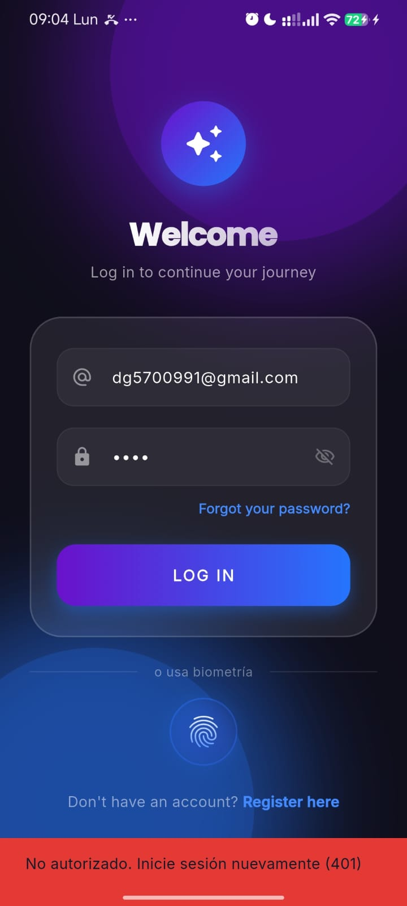</td>
    <td>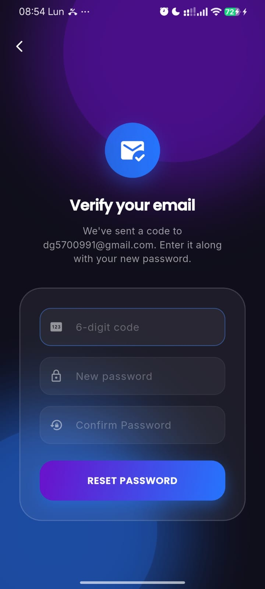</td>
    <td>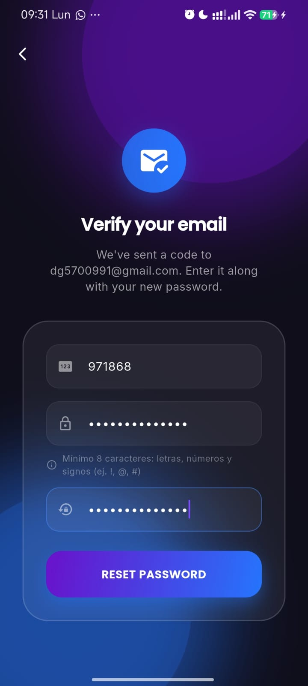</td>
    <td>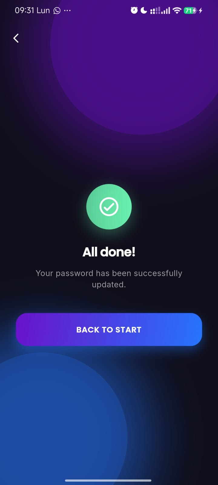</td>
  </tr>
</table>

### Estudiante

<table>
  <tr>
    <td align="center"><b>Explorar cursos</b></td>
    <td align="center"><b>Perfil</b></td>
    <td align="center"><b>Carrito</b></td>
    <td align="center"><b>Detalle lección</b></td>
  </tr>
  <tr>
    <td>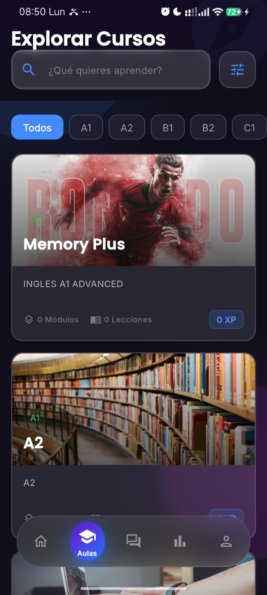</td>
    <td>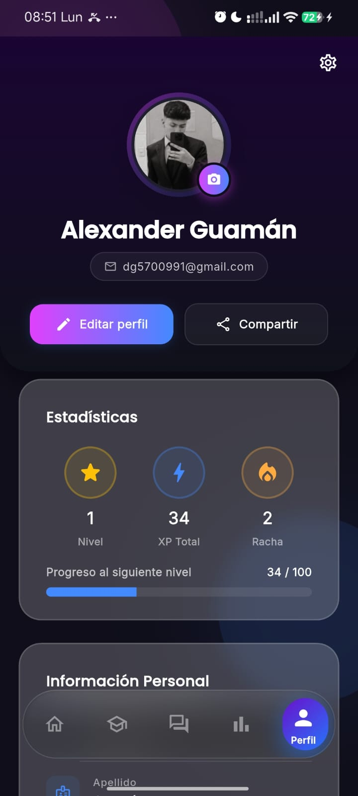</td>
    <td>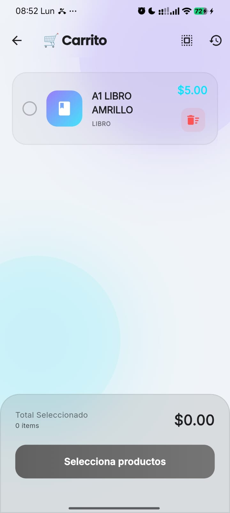</td>
    <td>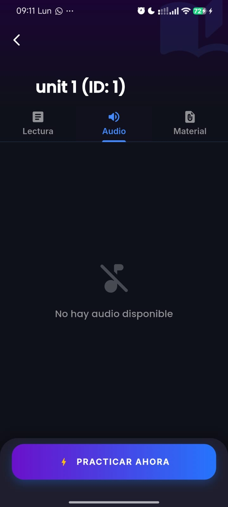</td>
  </tr>
</table>

### Profesor / Admin

<table>
  <tr>
    <td align="center"><b>Crear aula</b></td>
    <td align="center"><b>Crear lección</b></td>
    <td align="center"><b>Perfil teacher</b></td>
  </tr>
  <tr>
    <td>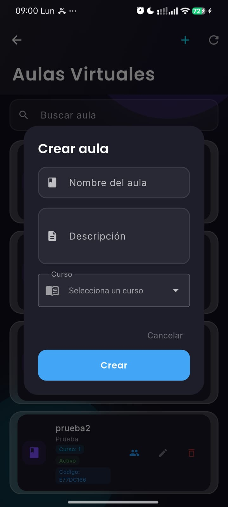</td>
    <td>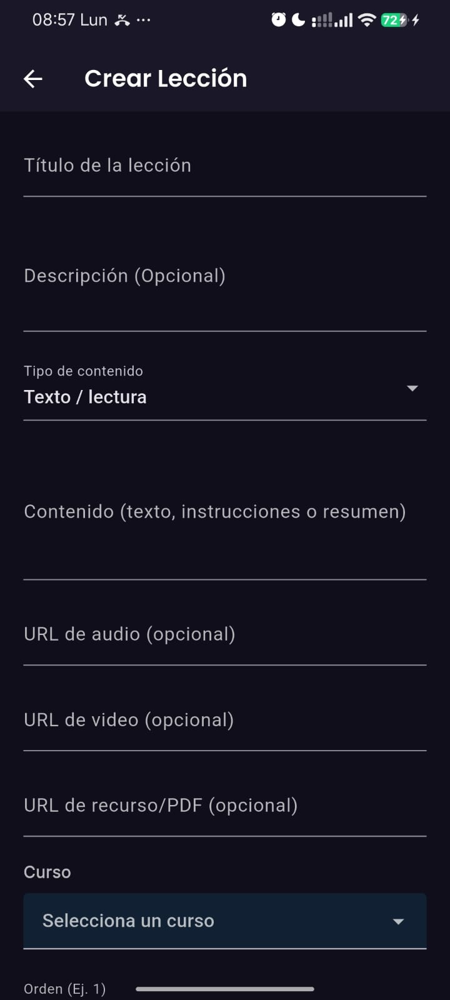</td>
    <td>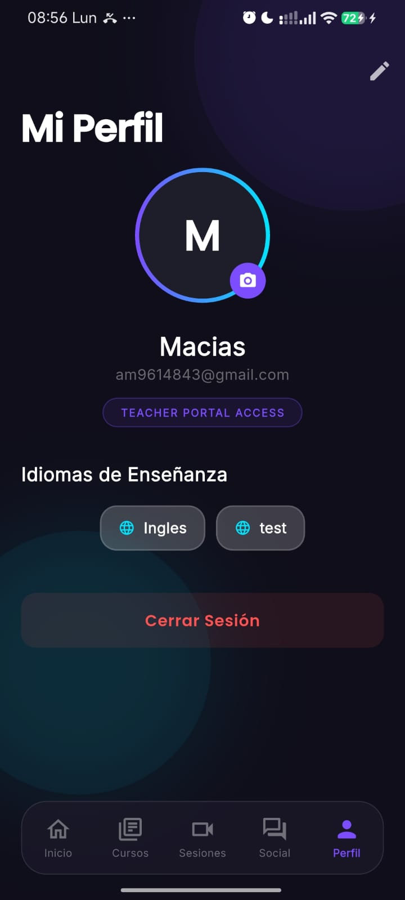</td>
  </tr>
</table>

### Correos del sistema

<table>
  <tr>
    <td align="center"><b>Código de recuperación</b></td>
    <td align="center"><b>Certificado obtenido</b></td>
  </tr>
  <tr>
    <td>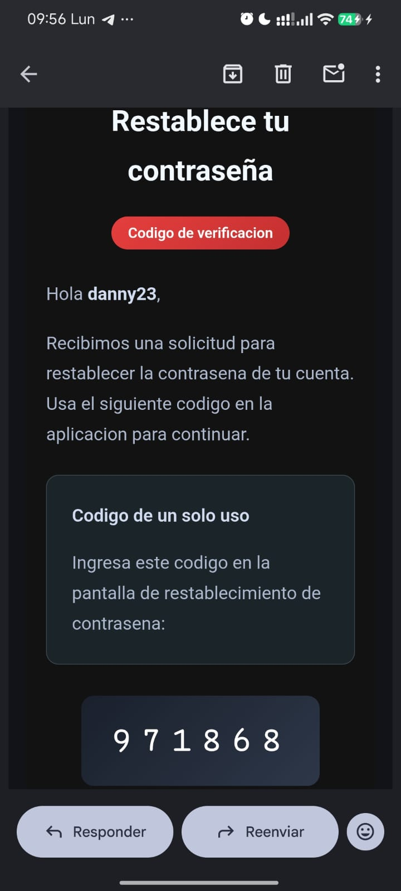</td>
    <td>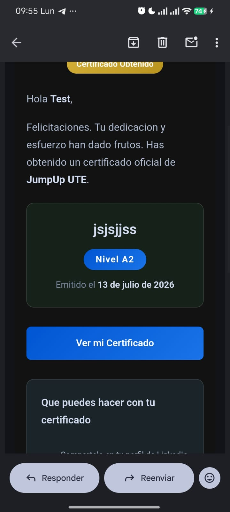</td>
  </tr>
</table>

---

## Funcionalidades

### Estudiante
- Acceso a cursos inscritos, módulos y lecciones por aula
- Ejercicios interactivos con repetición de errores y temporizador
- Gamificación: XP, niveles, rachas diarias y logros desbloqueables
- Minijuegos: Flashcards, Ahorcado, Trivia, Memory, Sopa de letras, Roleplay IA y más
- Ingreso a clases virtuales desde el aula asignada
- Recursos por lección: documentos, videos y links
- Tutor IA para practicar conversación
- Catálogo de cursos con carrito de compras e historial de pagos
- Ranking global y por curso

### Profesor / Admin
- Crear, editar y eliminar cursos con imagen desde galería
- Gestión de aulas: inscripción de estudiantes y solicitudes
- Creación y edición de módulos y lecciones
- Subida de recursos (video, imagen, PDF) desde galería o URL
- Programar y gestionar sesiones en vivo con código de acceso
- Reportes de progreso por aula

### Social
- Chat en tiempo real por WebSocket
- Feed comunitario con publicaciones y comentarios
- Notificaciones push y en tiempo real
- Búsqueda de cursos, usuarios y contenido

---

## Últimas actualizaciones

- Subida de imágenes de cursos desde galería del dispositivo
- Subida de recursos multimedia (video/imagen) con FormData
- Clases virtuales: muestra solo aulas en las que el estudiante está inscrito
- Recuperación de contraseña: errores reales del servidor, validación de longitud y coincidencia
- Mensaje de requisitos de contraseña en pantalla de recuperación
- Fix del filtrado de recursos por lección con `classroomId`
- Parsers defensivos en modelos de aulas y recursos
- Manejo de errores Lottie con `errorBuilder` en pantallas de ejercicios

---

## Requisitos previos

- Flutter SDK `>= 3.10.0`
- Dart SDK `>= 3.0.0`
- Android Studio / Xcode
- Git

---

## Instalación

```bash
# 1. Clonar el repositorio
git clone https://github.com/Axel-25-dg/jumpup_idiomas_movil.git
cd jumpup_idiomas_movil

# 2. Instalar dependencias
flutter pub get

# 3. Generar archivos de localización
flutter gen-l10n

# 4. Ejecutar la app
flutter run
```

---

## Configuración y Variables de Entorno

La aplicación móvil está configurada para conectarse al backend mediante la siguiente URL base de la API:

```
https://guaman-idiomas-ute.online/api/
```

Para cambiar la configuración del servidor, localice el archivo de configuración correspondiente en la app (usualmente en la capa de servicios o variables globales del entorno de desarrollo).

### Notificaciones push (Opcional)

Para configurar notificaciones push mediante Firebase:
- Android: ubique el archivo en `android/app/google-services.json`
- iOS: ubique el archivo en `ios/Runner/GoogleService-Info.plist`

---

## Credenciales de prueba

| Rol | Email | Contraseña |
|---|---|---|
| Estudiante | test@student.com | Clave1234! |
| Profesor | test@teacher.com | Clave1234! |
| Administrador | admin@jumpup.com | Clave1234! |

*Las credenciales reales deben ser proporcionadas por el equipo de desarrollo.*

---

## Conexión a la API y Endpoints principales

La aplicación consume servicios RESTful utilizando la biblioteca Dio en Flutter. A continuación, se detallan los endpoints agrupados por su respectiva funcionalidad:

<details>
<summary><strong>Autenticación</strong></summary>
<br>

| Método | Endpoint | Descripción |
|---|---|---|
| POST | `/api/auth/register/` | Registro de usuario |
| POST | `/api/auth/login/` | Inicio de sesión |
| POST | `/api/auth/token/refresh/` | Refrescar JWT |
| GET | `/api/auth/me/` | Datos del usuario autenticado |
| POST | `/api/auth/password-reset/` | Solicitar código de recuperación |
| POST | `/api/auth/password-reset-confirm/` | Confirmar código y nueva contraseña |

</details>

<details>
<summary><strong>Contenido educativo</strong></summary>
<br>

| Método | Endpoint | Descripción |
|---|---|---|
| GET | `/api/languages/` | Idiomas disponibles |
| GET/POST | `/api/courses/` | Cursos |
| GET | `/api/lessons/?module=<id>` | Lecciones de un módulo |
| GET | `/api/exercises/?lesson=<id>` | Ejercicios de una lección |
| POST | `/api/exercises/<id>/validar/` | Validar respuesta |
| POST | `/api/progress/` | Registrar progreso |
| GET | `/api/resources/?lesson=<id>&classroom=<id>` | Recursos por lección |

</details>

<details>
<summary><strong>Gamificación</strong></summary>
<br>

| Método | Endpoint | Descripción |
|---|---|---|
| GET | `/api/progress/summary/` | Resumen de progreso |
| GET | `/api/stats/` | XP, rachas y nivel |
| GET | `/api/achievements/` | Logros disponibles |
| GET | `/api/my-achievements/` | Mis logros |
| GET | `/api/ranking/` | Tabla de clasificación |

</details>

<details>
<summary><strong>E-commerce</strong></summary>
<br>

| Método | Endpoint | Descripción |
|---|---|---|
| GET | `/api/catalogo/` | Catálogo de productos |
| GET | `/api/carrito/` | Ver carrito |
| POST | `/api/carrito/agregar/` | Agregar al carrito |
| POST | `/api/carrito/comprar/` | Realizar compra |
| GET | `/api/ordenes-compra/` | Historial de compras |

</details>

<details>
<summary><strong>Aulas y sesiones</strong></summary>
<br>

| Método | Endpoint | Descripción |
|---|---|---|
| GET | `/api/classrooms/` | Mis aulas |
| POST | `/api/classrooms/join/` | Unirse con código |
| GET | `/api/live-sessions/` | Sesiones en vivo |

</details>

---

## Estructura del proyecto

```
lib/
├── core/                 # Constantes, helpers, excepciones
├── data/
│   ├── model/            # DTOs y mappers de la API
│   └── repository/       # Implementaciones de repositorios
├── domain/
│   └── model/            # Modelos de dominio
├── presentation/
│   ├── providers/        # Estado global con Riverpod
│   ├── screens/
│   │   ├── auth/         # Login, registro, recuperar contraseña
│   │   ├── student/      # Dashboard, cursos, ejercicios, juegos
│   │   ├── admin/        # Panel profesor/admin
│   │   ├── social/       # Chat, feed, sesiones en vivo
│   │   └── catalog/      # Catálogo y e-commerce
│   └── widgets/          # Componentes reutilizables
├── services/             # Auth, API, WebSocket, IA
├── theme/                # Temas claro/oscuro y estilos
└── main.dart
```

---

## Comandos útiles

```bash
flutter analyze               # Analizar código
flutter test                  # Ejecutar tests
flutter gen-l10n              # Generar archivos de traducción
flutter build apk --release   # Build Android
flutter build ios --release   # Build iOS
```

---

## Equipo

Proyecto desarrollado como parte de la asignatura de **Programación de Aplicaciones Móviles** — Universidad UTE.

**Presentado por:**
- Danny Guamán
- Alex Macias
- Ariel Paucar

---

## Soporte

¿Problemas o sugerencias? Abre un [Issue](https://github.com/Axel-25-dg/jumpup_idiomas_movil/issues).
