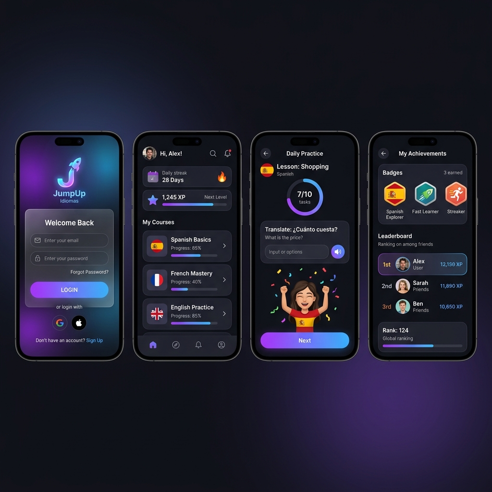

<![CDATA[<p align="center">
  
</p>

<h1 align="center">JumpUp Idiomas — App Móvil</h1>

<p align="center">
  Aplicación móvil de aprendizaje de idiomas desarrollada con <strong>Flutter</strong>, conectada a un backend <strong>Django REST Framework</strong>.
</p>

<p align="center">
  
  
  
  
</p>

---

## 📱 Capturas de pantalla

<p align="center">
  
</p>

---

## ✨ Características principales

### 👩‍🎓 Módulo Estudiante
| Funcionalidad | Descripción |
|---|---|
| 📚 Cursos y lecciones | Acceso a cursos inscritos, módulos y lecciones por aula |
| 🎯 Ejercicios interactivos | Ejercicios con repetición de errores, temporizador y feedback inmediato |
| 🏆 Gamificación completa | XP, niveles, rachas diarias y logros desbloqueables |
| 🎮 Minijuegos | Flashcards, Ahorcado, Trivia, Sopa de letras, Memory, Roleplay IA y más |
| 📺 Clases virtuales | Ingreso a sesiones en vivo desde el aula asignada |
| 📂 Recursos por lección | Visualización de documentos, videos y links por lección |
| 🤖 Tutor IA | Chat con inteligencia artificial para practicar idiomas |
| 🛒 E-commerce | Catálogo de cursos, carrito de compras y pagos |
| 🏅 Ranking | Tabla de clasificación global y por curso |
| 🔐 Recuperación de contraseña | Flujo por correo con código OTP, validación de requisitos y mensajes de error reales |

### 👨‍🏫 Módulo Profesor / Admin
| Funcionalidad | Descripción |
|---|---|
| 📋 Gestión de cursos | Crear, editar y eliminar cursos con imagen desde galería |
| 🏫 Gestión de aulas | Crear aulas, inscribir estudiantes y gestionar solicitudes |
| 📝 Módulos y lecciones | Creación y edición de contenido educativo jerárquico |
| 📁 Recursos | Subida de archivos (video/imagen/PDF) desde galería del dispositivo o URL |
| 🔴 Sesiones en vivo | Programar y gestionar clases virtuales con código de acceso |
| 📊 Reportes | Visualización de progreso y estadísticas por aula |
| 📨 Bandeja de entrada | Mensajes y notificaciones del sistema |

### 🌐 Social
| Funcionalidad | Descripción |
|---|---|
| 💬 Chat en tiempo real | Mensajería vía WebSocket por aula |
| 📢 Feed comunitario | Publicaciones y comentarios entre usuarios |
| 🔔 Notificaciones | Push y en tiempo real |
| 🔍 Búsqueda | Búsqueda de cursos, usuarios y contenido |

---

## 🆕 Cambios recientes (v2.x)

- ✅ **Subida de imágenes de cursos desde galería** (reemplaza el campo URL)
- ✅ **Subida de recursos multimedia desde galería** (video e imagen con FormData)
- ✅ **Clases virtuales**: ahora muestra solo las aulas en que está inscrito el estudiante
- ✅ **Recuperación de contraseña**: muestra errores reales del servidor, valida longitud y coincidencia
- ✅ **Mensaje de requisitos de contraseña** en la pantalla de recuperación
- ✅ **Fix del filtrado de recursos** por lección con `classroomId`
- ✅ **Parsers defensivos** en modelos de aulas y recursos para evitar crashes
- ✅ **Manejo de errores Lottie** con `errorBuilder` en pantallas de ejercicios

---

## 🛠️ Requisitos previos

- Flutter SDK `>= 3.10.0`
- Dart SDK `>= 3.0.0`
- Android Studio / Xcode
- Git

---

## 🚀 Instalación

```bash
# 1. Clonar el repositorio
git clone https://github.com/Axel-25-dg/jumpup_idiomas_movil.git
cd jumpup_idiomas_movil

# 2. Instalar dependencias
flutter pub get

# 3. Generar archivos de localización
flutter gen-l10n

# 4. Ejecutar la app
flutter run
```

---

## ⚙️ Configuración

### URL de la API
La app se conecta al backend en:
```
https://guaman-idiomas-ute.online/api/
```
Configurada en `lib/services/api_service.dart`.

### Firebase (opcional)
Para notificaciones push configura:
- Android: `android/app/google-services.json`
- iOS: `ios/Runner/GoogleService-Info.plist`

---

## 🔑 Credenciales de prueba

| Rol | Email | Contraseña |
|---|---|---|
| Estudiante | test@student.com | Clave1234! |
| Profesor | test@teacher.com | Clave1234! |
| Administrador | admin@jumpup.com | Clave1234! |

> *Las credenciales reales deben ser proporcionadas por el equipo de desarrollo.*

---

## 🔌 Endpoints principales de la API

### Autenticación
| Método | Endpoint | Descripción |
|---|---|---|
| POST | `/api/auth/register/` | Registro de usuario |
| POST | `/api/auth/login/` | Inicio de sesión |
| POST | `/api/auth/token/refresh/` | Refrescar JWT |
| GET | `/api/auth/me/` | Datos del usuario autenticado |
| POST | `/api/auth/password-reset/` | Solicitar código de recuperación |
| POST | `/api/auth/password-reset-confirm/` | Confirmar código y nueva contraseña |

### Contenido educativo
| Método | Endpoint | Descripción |
|---|---|---|
| GET | `/api/languages/` | Idiomas disponibles |
| GET/POST | `/api/courses/` | Cursos |
| GET | `/api/lessons/?module=<id>` | Lecciones de un módulo |
| GET | `/api/exercises/?lesson=<id>` | Ejercicios de una lección |
| POST | `/api/exercises/<id>/validar/` | Validar respuesta |
| POST | `/api/progress/` | Registrar progreso |
| GET | `/api/resources/?lesson=<id>&classroom=<id>` | Recursos de lección |

### Gamificación
| Método | Endpoint | Descripción |
|---|---|---|
| GET | `/api/progress/summary/` | Resumen de progreso |
| GET | `/api/stats/` | XP, rachas, nivel |
| GET | `/api/achievements/` | Logros disponibles |
| GET | `/api/my-achievements/` | Mis logros |
| GET | `/api/ranking/` | Tabla de clasificación |

### E-commerce
| Método | Endpoint | Descripción |
|---|---|---|
| GET | `/api/catalogo/` | Catálogo de productos |
| GET | `/api/carrito/` | Ver carrito |
| POST | `/api/carrito/agregar/` | Agregar al carrito |
| POST | `/api/carrito/comprar/` | Realizar compra |
| GET | `/api/ordenes-compra/` | Historial de compras |

### Aulas y sesiones
| Método | Endpoint | Descripción |
|---|---|---|
| GET | `/api/classrooms/` | Mis aulas |
| POST | `/api/classrooms/join/` | Unirse con código |
| GET | `/api/live-sessions/` | Sesiones en vivo |
| GET | `/api/resources/` | Recursos del aula |

---

## 📁 Estructura del proyecto

```
lib/
├── core/                    # Constantes, helpers, excepciones
├── data/
│   ├── model/               # DTOs y mappers de la API
│   └── repository/          # Implementaciones de repositorios
├── domain/
│   └── model/               # Modelos de dominio
├── presentation/
│   ├── providers/           # Estado global con Riverpod
│   ├── screens/
│   │   ├── auth/            # Login, registro, recuperar contraseña
│   │   ├── student/         # Dashboard, cursos, ejercicios, juegos
│   │   ├── admin/           # Panel profesor/admin
│   │   ├── social/          # Chat, feed, sesiones en vivo
│   │   └── catalog/         # Catálogo y e-commerce
│   └── widgets/             # Componentes reutilizables
├── services/                # Auth, API, WebSocket, IA
├── theme/                   # Temas claro/oscuro, estilos
└── main.dart
```

---

## 🧪 Comandos útiles

```bash
# Analizar código
flutter analyze

# Ejecutar tests
flutter test

# Generar archivos de traducción
flutter gen-l10n

# Build Android release
flutter build apk --release

# Build iOS release
flutter build ios --release
```

---

## 👥 Equipo de desarrollo

Proyecto desarrollado como parte de la asignatura de Programación de Aplicaciones Móviles — **Universidad UTE**.

---

## 📬 Soporte

Para consultas o problemas, abre un [Issue](https://github.com/Axel-25-dg/jumpup_idiomas_movil/issues) en el repositorio.
]]>
